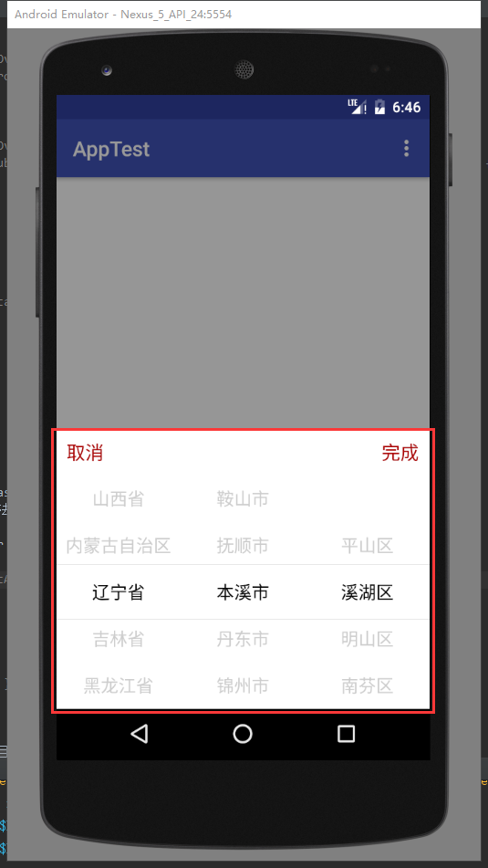
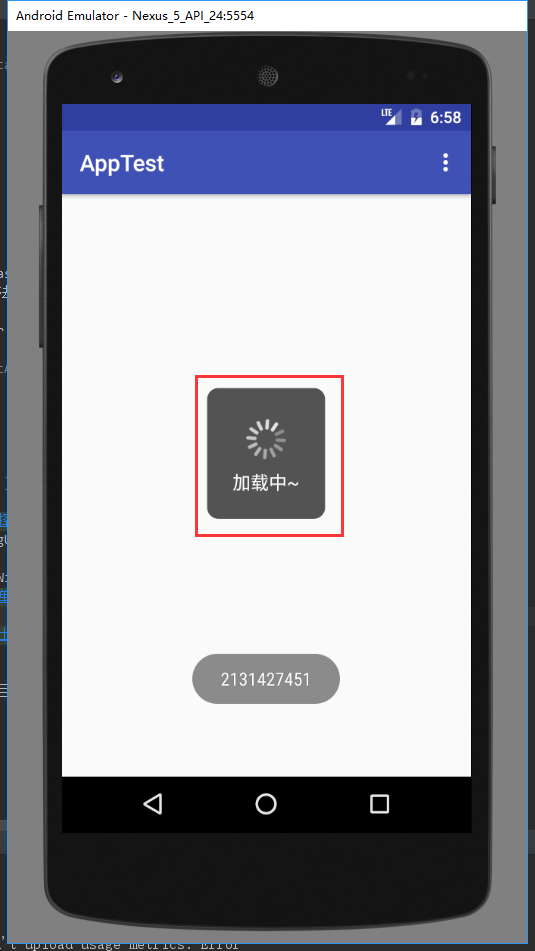
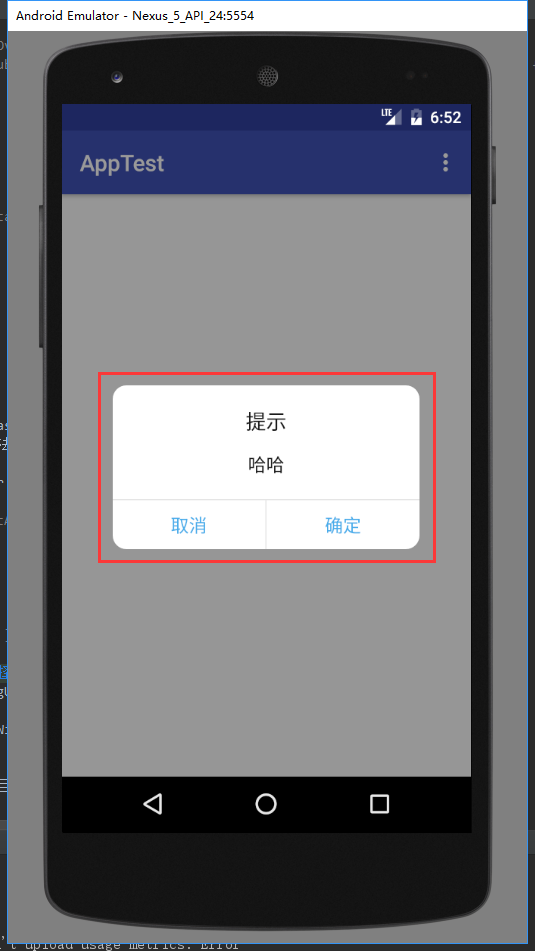
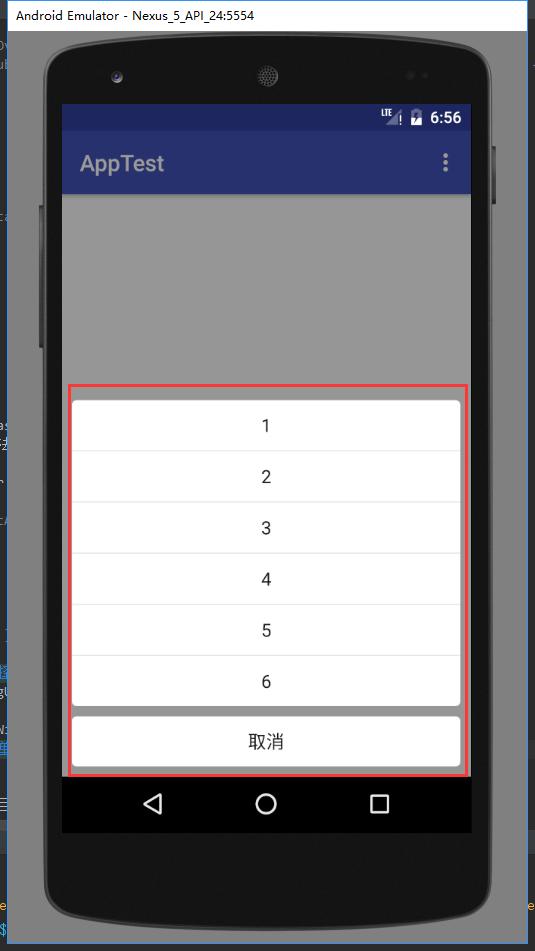

# library
***
- 网络请求操作类 MxHttpRequest
get请求，post请求，文件下载等等
```
 Params params = new Params();
        params.add("key","value");
        MxHttpRequest.get("url", params, new BaseHttpRequestCallback<BaseBean>() {//打一个参数baseUrl,第二个参数拼接请求参数，第三个参数请求结果回调，传入泛型直接解析出来对象

            @Override
            public void onSuccess(BaseBean baseBean) {
                LogUtils.d("请求成功");
            }

            @Override
            public void onFailure(int errorCode, String msg) {
                LogUtils.d("请求失败");
            }
        });
 ```
 - 图片加载工具类 ImageLoader
基于Glide 实现的，实现加载圆形图片等

 ```
 //加载普通图片
 ImageLoader.getInstance().displayImage("context上下文","图片链接url",imgageView);
 //加载圆形图片
 ImageLoader.getInstance().displayCircleImage("context上下文","图片链接url",imgageView);
 ```
 - BaseApp 封装基类 app
 - BaseActivity 封装基类 activity
 - BaseFragment 封装基类 fragment

 - BaseAdapter 封装一些常用的 Adapter
   1.  RecyclerView.Adapter 封装的
   - RvSimpleAdapter 使用方法
   ```
   public class RvAdapter extends RvSimpleAdapter<String> {

       public RvAdapter(List<String> data, Context context) {
           super(data, context);
       }

       @Override
       protected int getLayout(int viewType) {
           return R.layout.rv_adapter;
       }

       @Override
       public void onBindViewHolder(RvSimpleAdapter.ViewHolder holder, final int position) {
           holder.setText(R.id.T_1, data.get(position))
                   .setText(R.id.T_1, data.get(position))
                   .setImage(R.id.I_1, data.get(position))
                   .setImage(R.id.I_1, data.get(position))
                   .setOnClickListener(R.id.T_2, new View.OnClickListener() {
                       @Override
                       public void onClick(View v) {
                           App.getInstance().showToast(data.get(position));
                       }
                   });
       }
   }

   ```
   - RvKnifeAdapter 使用方法
   ```
   public class RvAdapter extends RvKnifeAdapter<String, RvKnifeAdapter.ViewHolder> {

       public RvAdapter(List<String> data, Context context) {
           super(data, context);
       }

       @Override
       protected int getLayout(int viewType) {
           return R.layout.rv_adapter;
       }

       @Override
       protected ViewHolder onCreateViewHolder(View convertView) {
           return new ViewHolder(convertView);
       }

       @Override
       public void onBindViewHolder(ViewHolder holder, final int position) {
           holder.mT1.setText(data.get(position));
           holder.mT1.setText(data.get(position));
           holder.mT1.setText(data.get(position));
           holder.mT1.setText(data.get(position));

       }

       static class ViewHolder extends RecyclerView.ViewHolder {
           @BindView(R.id.T_1)
           TextView mT1;

           ViewHolder(View view) {
               super(view);
               ButterKnife.bind(this, view);
           }
       }
   }
   ```
   2.  BaseAdapter 封装的
   使用方法类似RecyclerView.Adapter上面的

 - picker 模仿ios 的省市县三级联动
 ```
 new InitAreaTask(this, new InitAreaTask.CityPickerCallBack() {
             @Override
             public void onFinish(String address) {
                 LogUtils.d("返回的地址字符串");

             }
         }).execute();
 ```
 

 - DialogUtils 模仿ios 的加载样式
 

 - PopupWindowUtils 模仿ios 简单选择样式 底部弹出选择样式
 

 


- Uitils目录地下工具类 一些常用工具

